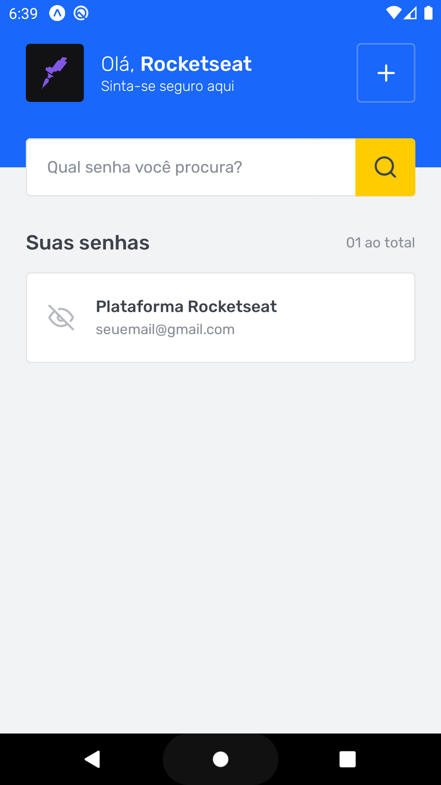
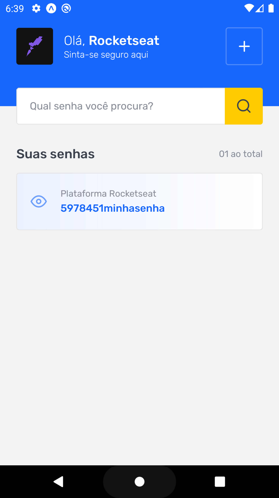
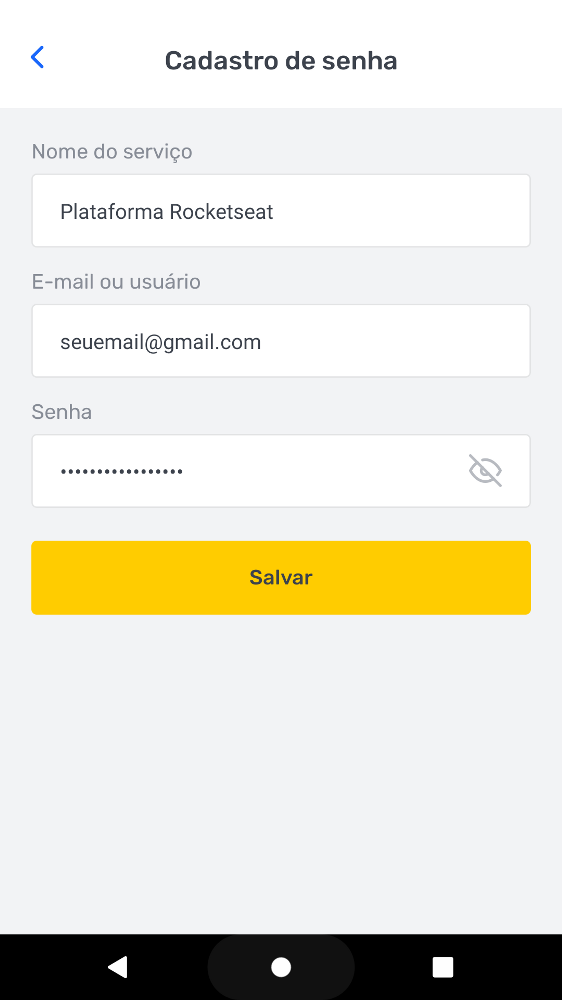

<div align="center">
  
 <h1 > SavePass </h1>
</div>

---

<div align="center">
  
  
  
  
  
  
 
</div>


##  💻 Sobre o desafio
O SavePass é o desafio do Ignite da trilha de React-Native. Nele, praticamos a lógica de programação com TypeScript para criação das funcionalidades desse aplicativo assim como toda estrutura para as requisições do Async-Storage, ou seja o armazenamento local no dispositivo.


---


##  ⚙️ Funcionalidades

- Listagem geral das contas.
- Cadastro de novas contas e senhas.
- Filtragem da lista geral de contas salvas.


---

## 🚀 Como executar o projeto


#### 🧭 Rodando a aplicação

```bash

# Clone este repositório
$ git clone git@github.com:pcaldi/desafio01-savepass.git

# Acesse a pasta do projeto no seu terminal/cmd
$ cd desafio01-savepass

# Instale as dependências
$ npm install
# ou
$ yarn

# Execute a aplicação
$ expo start

```
---
## :rocket: O projeto foi desenvolvido utilizando as seguintes tecnologias

- [Android Studio](https://developer.android.com/studio)
- [Async Storage](https://react-native-async-storage.github.io/async-storage/docs/usage/)
- [Expo](https://expo.dev/)
- [Javascript](https://developer.mozilla.org/pt-BR/docs/Web/JavaScript)
- [NodeJS](https://nodejs.org/en/)
- [React](https://pt-br.reactjs.org/)
- [React-Native](https://reactnative.dev/)
- [React Navigation](https://reactnavigation.org/)
- [Styled Components](https://www.styled-components.com/)
- [TypeScript](https://www.typescriptlang.org/)
- [Yarn](https://classic.yarnpkg.com/blog/2017/05/12/introducing-yarn/)
___


---
## 📲 Contato


<a href="mailto:pcaldi@gmail.com"></a>

<a href="https://www.linkedin.com/in/pcaldi/"></a>

 <a >
    
  </a>

## :closed_book: Licença
<a>
  
</a>

Esse projeto possui [licença MIT](./LICENSE).


  
